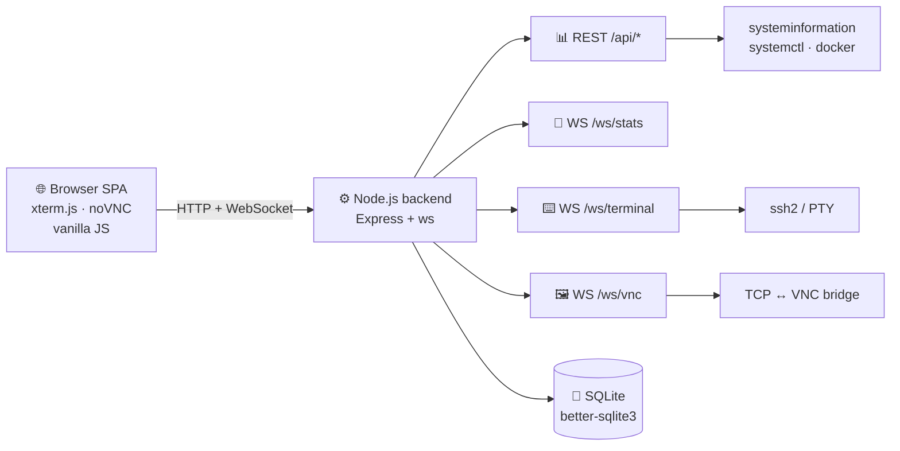

<div align="center">


# 🛰️ WebPanel

**Modern server control panel inspired by Vercel & Cloudflare**
Dark, minimal, fast. Works from your phone, tablet and desktop.

[](LICENSE)


[🇷🇺 Русский](README.md) · [🇬🇧 English](README.en.md)

</div>

---

## ✨ Features

| | |
|---|---|
| 📊 **Live dashboard** | CPU, RAM, disks, network over WebSocket. Sparkline charts. |
| 🖥️ **Multi-server** | Manage remote hosts over SSH (password or key). Local host out of the box. |
| ⌨️ **Web terminal** | Full xterm.js: local bash or remote SSH. With an **on-screen keyboard** (Ctrl/Esc/Tab/arrows/^O/^X) so you can actually use nano/vim from a phone. |
| 🖼️ **VNC viewer** | Embedded noVNC. Backend proxies WebSocket ↔ TCP. |
| ⚙️ **systemd** | All units, filter by type/state, drawer with status, **journalctl logs**, `systemctl show` properties, start/stop/restart/reload/enable/disable. |
| 🐳 **Docker** | Containers (start/stop/restart/pause/kill/rm), live stats, **logs**, inspect, images, pull, prune. |
| 🧬 **Processes** | Top, filter, kill in one tap. |
| 📱 **Mobile first** | Off-canvas sidebar, 38+px touch targets, on-screen terminal keys. |
| ⚡ **Keyboard** | `Ctrl+K` palette, `g+d/s/t/v/e/p/k` navigation, `?` help, `/` filter. |
| 🔐 **Auth** | JWT in HttpOnly cookie, bcrypt. Username/password via `.env`. |

## 🖼️ Screenshots

<div align="center">


_Dashboard: real-time CPU/RAM/Disk/Net charts, system info, top processes_

<br />


_Terminal with on-screen keyboard — `^O` saves in nano with one tap_

</div>

## 🚀 Quick start

```bash
git clone https://github.com/rv0x3l/webpanel.git /opt/webpanel
cd /opt/webpanel
./scripts/install.sh
```

The installer:
1. 🔑 Generates a random JWT secret
2. 📦 Installs npm dependencies
3. ⚙️ Registers the systemd unit and starts it
4. 🌐 Prints the URL

Open `http://<host>:8787`. Default credentials: `admin` / `admin`. **Change them immediately:**

```bash
./scripts/reset-password.sh "your-new-strong-password"
systemctl restart webpanel
```

### 🐳 Docker

```bash
git clone https://github.com/rv0x3l/webpanel.git && cd webpanel
JWT_SECRET=$(openssl rand -hex 32) ADMIN_PASSWORD=secret docker compose up -d
```

### 🧰 Manual

```bash
cd backend
cp .env.example .env   # edit ADMIN_PASSWORD and JWT_SECRET
npm install
node server.js
```

## 🧠 Architecture



- **DB:** SQLite, file at `backend/data/panel.db`
- **Auth:** JWT in HttpOnly cookie + `Bearer` for API
- **No external services needed at runtime** — a single Node process

## ⚙️ Configuration

`backend/.env`:

| Variable | Default | Description |
|---|---|---|
| `PORT` | `8787` | HTTP port |
| `HOST` | `0.0.0.0` | Bind address |
| `JWT_SECRET` | _(random)_ | JWT signing key |
| `ADMIN_USERNAME` | `admin` | Created on first run |
| `ADMIN_PASSWORD` | `admin` | Created on first run — **change it!** |
| `DB_PATH` | `./data/panel.db` | SQLite path |

## 🔒 Production: nginx + HTTPS

Always run behind HTTPS in production:

```nginx
server {
    listen 443 ssl http2;
    server_name panel.example.com;
    ssl_certificate     /etc/letsencrypt/live/panel.example.com/fullchain.pem;
    ssl_certificate_key /etc/letsencrypt/live/panel.example.com/privkey.pem;

    location / {
        proxy_pass http://127.0.0.1:8787;
        proxy_http_version 1.1;
        proxy_set_header Host $host;
        proxy_set_header X-Forwarded-For $remote_addr;
        proxy_set_header Upgrade $http_upgrade;
        proxy_set_header Connection "upgrade";
        proxy_read_timeout 86400;
    }
}
```

Bind to localhost:

```env
HOST=127.0.0.1
```

## ⚠️ Security

- The panel runs **as root** to allow reboot/kill/systemd/Docker. Use only on trusted networks, behind HTTPS, with a strong password.
- `.env` contains secrets. Don't commit it (it's in `.gitignore`).
- SSH credentials for remote hosts are stored in plaintext in SQLite. Encrypted storage — PRs welcome 🙌

## ⌨️ Hotkeys

| Action | Keys |
|---|---|
| 🎯 Command palette | `Ctrl/Cmd + K` |
| ❓ Help | `?` |
| 🔄 Refresh view | `r` |
| 📱 Toggle sidebar | `m` |
| 🔍 Focus filter | `/` |
| ✖️ Close modal/drawer | `Esc` |
| 🧭 Navigate | `g` then `d` (dashboard) `s` (servers) `t` (terminal) `v` (vnc) `e` (services) `p` (processes) `k` (docker) |

**In the terminal** there's an on-screen keys bar: `Ctrl Alt Shift Esc Tab ⌫ ↑↓←→ Home End PgUp PgDn ^C ^D ^L ^Z ^O ^X ^W ^K ^U F1…F12`, plus Copy / Paste / Clear / Reconnect. Sticky modifiers: tap Ctrl → it lights up orange → next character is sent as Ctrl+key → modifier auto-resets.

## 🗺️ Roadmap

- [ ] 🔐 2FA (TOTP)
- [ ] 👥 Multi-user with roles
- [ ] 🔑 Encrypted SSH credential storage
- [ ] 🌐 WireGuard / Tailscale tab
- [ ] 📈 Historical graphs (cAdvisor-style)
- [ ] 🔌 Plugin system
- [ ] 📜 File manager
- [ ] 🔔 Webhooks / Telegram alerts

## 🤝 Contributing

See [CONTRIBUTING.md](CONTRIBUTING.md). PRs welcome. Bug reports and ideas too 🙏

## 📜 License

[MIT](LICENSE) © WebPanel contributors

## 🙏 Credits

- [xterm.js](https://xtermjs.org/) — terminal emulator
- [noVNC](https://novnc.com/) — VNC client
- [systeminformation](https://systeminformation.io/) — stats
- [ssh2](https://github.com/mscdex/ssh2) — remote shells

<div align="center">
<br />

⭐ **Star if you like the project** ⭐

</div>
