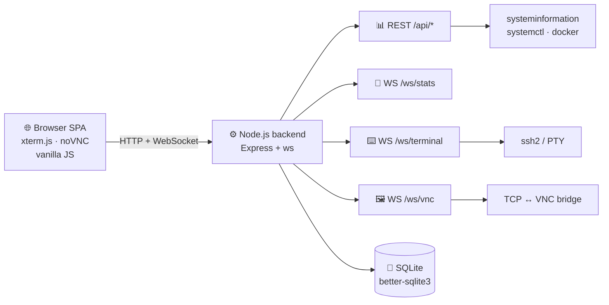

# ⚡ 𝚆𝙴𝙱𝙿𝙰𝙽𝙴𝙻 — 𝚂𝚎𝚛𝚟𝚎𝚛 𝙲𝚘𝚗𝚝𝚛𝚘𝚕 𝙿𝚊𝚗𝚎𝚕 🛰️

<a href="https://t.me/rv0x3l">
  
</a>

<br/>

> **`System Status:`** *Modern, mobile-friendly server control panel in the style of Vercel & Cloudflare* 🚀

<p align="left">
  <a href="LICENSE"></a>
  
  
  
  
</p>

---

### 🚧 Скриншоты

<p align="center">
  
</p>
<p align="center">
  
  <br/><i>Дашборд: real-time графики CPU/RAM/Disk/Net</i>
</p>
<p align="center">
  
  <br/><i>Терминал с экранной клавиатурой — <code>^O</code> сохраняет в nano с одного тапа</i>
</p>

---

### 🛠️ Стек

#### **Backend**
<code></code>
<code></code>
<code></code>
<code></code>
<code></code>
<code></code>

#### **Frontend**
<code></code>
<code></code>
<code></code>
<code></code>
<code></code>

#### **Платформа**
<code></code>
<code></code>
<code></code>
<code></code>

---

### 🚀 Возможности

* 📊 **Live дашборд** — CPU, RAM, диски, сеть в реальном времени по WebSocket, sparkline-графики
* 🖥️ **Несколько серверов** — управление удалёнными хостами по SSH (пароль или ключ)
* ⌨️ **Веб-терминал** — xterm.js с **экранной клавиатурой** (Ctrl/Esc/Tab/стрелки/`^O`/`^X`) — работа с nano/vim на телефоне
* 🖼️ **VNC viewer** — встроенный noVNC, бэкенд проксирует WS↔TCP
* ⚙️ **systemd** — все юниты, фильтр, drawer со статусом и journalctl-логами, start/stop/enable/disable
* 🐳 **Docker** — контейнеры, stats, логи, inspect, образы, pull, prune
* 🧬 **Процессы** — топ, фильтр, kill в один тап
* 📱 **Mobile-first** — off-canvas сайдбар, touch-кнопки 38+px
* ⚡ **Hotkeys** — `Ctrl+K` палитра, `g+d/s/t/v/e/p/k` навигация, `?` помощь, `/` фильтр

---

### 📦 Quick Start

```bash
git clone https://github.com/rv0x3l/webpanel.git /opt/webpanel
cd /opt/webpanel
./scripts/install.sh
```

Открывай `http://<server>:8787` → логин `admin` / `admin` → смени пароль:

```bash
./scripts/reset-password.sh "your-strong-password"
systemctl restart webpanel
```

#### 🐳 Через Docker

```bash
git clone https://github.com/rv0x3l/webpanel.git && cd webpanel
JWT_SECRET=$(openssl rand -hex 32) ADMIN_PASSWORD=secret docker compose up -d
```

---

### 🧠 Архитектура



---

### ⌨️ Горячие клавиши

| Действие | Клавиши |
|---|---|
| 🎯 Палитра команд | `Ctrl/Cmd + K` |
| ❓ Помощь | `?` |
| 🔄 Обновить раздел | `r` |
| 📱 Сайдбар | `m` |
| 🔍 Фильтр | `/` |
| ✖️ Закрыть | `Esc` |
| 🧭 Навигация | `g` затем `d/s/t/v/e/p/k` |

**В терминале:** `Ctrl Alt Shift Esc Tab ⌫ ↑↓←→ Home End PgUp PgDn ^C ^D ^L ^Z ^O ^X ^W ^K ^U F1…F12` + Copy/Paste/Clear/Reconnect

---

### 🗺️ Roadmap

* [ ] 🔐 2FA (TOTP)
* [ ] 👥 Multi-user с ролями
* [ ] 🔑 Шифрованное хранилище SSH-кредов
* [ ] 🌐 WireGuard / Tailscale
* [ ] 📈 Исторические графики
* [ ] 🔌 Plugin-система
* [ ] 📜 Файловый менеджер
* [ ] 🔔 Webhooks / Telegram алерты

---

### 📊 Статистика репозитория

<p align="left">
  <a href="https://github.com/rv0x3l/webpanel">
    
  </a>
</p>

<p align="left">
  
</p>

---

### 🤝 Контрибьютинг

PR'ы и идеи приветствуются 🙏 См. [CONTRIBUTING.md](CONTRIBUTING.md)

### 📜 Лицензия

[MIT](LICENSE) © [rv0x3l](https://github.com/rv0x3l)

### 🙏 Благодарности

[xterm.js](https://xtermjs.org/) · [noVNC](https://novnc.com/) · [systeminformation](https://systeminformation.io/) · [ssh2](https://github.com/mscdex/ssh2)

---

<p align="center">
  <a href="https://t.me/rv0x3l"></a>
  
</p>

<p align="center">
  ⭐ <b>Если зашло — поставь звезду</b> ⭐
</p>

<p align="center">
  
</p>
