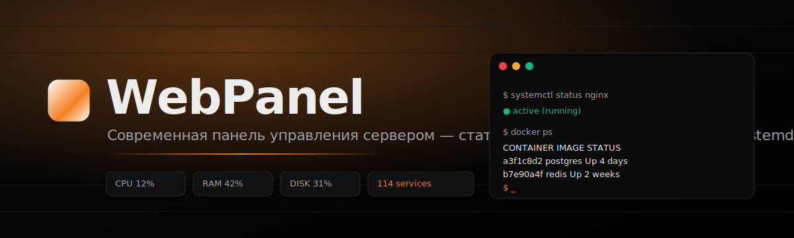
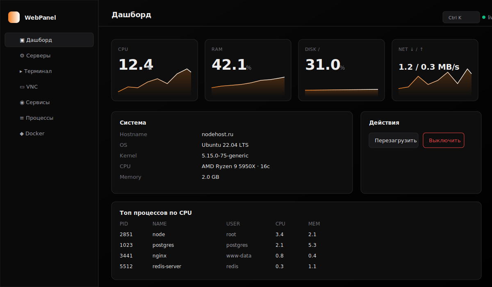
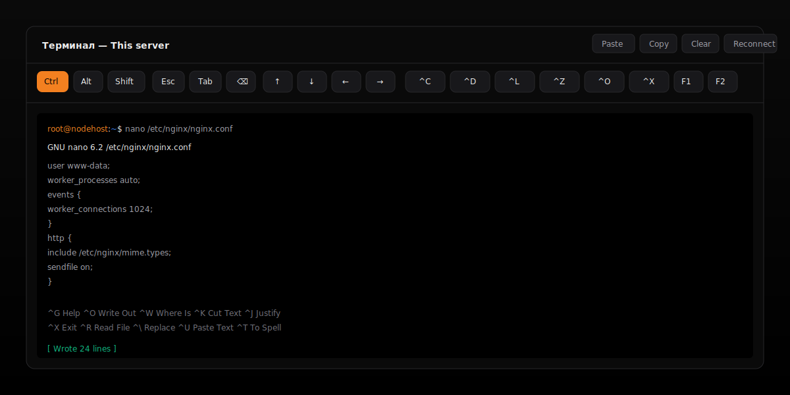
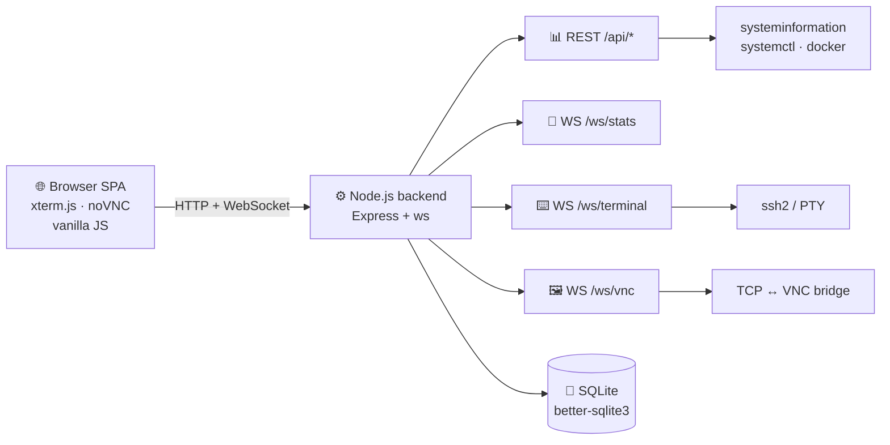

<div align="center">



# 🛰️ WebPanel

**Современная панель управления сервером в стиле Vercel / Cloudflare**
Тёмная, минималистичная, быстрая. Работает с телефона, планшета и десктопа.

[](LICENSE)


[🇷🇺 Русский](README.md) · [🇬🇧 English](README.en.md)

</div>

---

## ✨ Возможности

| | |
|---|---|
| 📊 **Live дашборд** | CPU, RAM, диски, сеть в реальном времени по WebSocket. Sparkline-графики. |
| 🖥️ **Несколько серверов** | Управляй удалёнными хостами по SSH (пароль или ключ). Локальный сервер из коробки. |
| ⌨️ **Веб-терминал** | Полноценный xterm.js: локальный bash или SSH. С **экранной клавиатурой** (Ctrl/Esc/Tab/стрелки/^O/^X), чтобы реально работать с nano/vim на телефоне. |
| 🖼️ **VNC viewer** | Встроенный noVNC. Бэкенд проксирует WebSocket ↔ TCP. |
| ⚙️ **systemd** | Все юниты, фильтр по типу/состоянию, drawer со статусом, **journalctl-логами**, `systemctl show`, и кнопками start/stop/restart/reload/enable/disable. |
| 🐳 **Docker** | Контейнеры (start/stop/restart/pause/kill/rm), live stats, **логи**, inspect, образы, pull, prune. |
| 🧬 **Процессы** | Топ, фильтр, kill в один тап. |
| 📱 **Mobile first** | Off-canvas сайдбар, тач-кнопки 38+px, экранная клавиатура для терминала. |
| ⚡ **Клавиатура** | `Ctrl+K` — палитра команд, `g+d/s/t/v/e/p/k` — навигация, `?` — помощь, `/` — фильтр. |
| 🔐 **Auth** | JWT в HttpOnly cookie, bcrypt. Логин и пароль через `.env`. |

## 🖼️ Скриншоты

> Mockup-превью — реальные скриншоты добавлю после первого деплоя. Пулл-реквесты приветствуются ✌️

<div align="center">



_Дашборд: real-time графики CPU/RAM/Disk/Net, инфо о системе, топ процессов_

<br />



_Терминал с экранной клавиатурой — `^O` сохраняет в nano с одного тапа_

</div>

## 🚀 Быстрый старт

```bash
git clone https://github.com/rv0x3l/webpanel.git /opt/webpanel
cd /opt/webpanel
./scripts/install.sh
```

Установщик:
1. 🔑 Генерирует случайный JWT-секрет
2. 📦 Ставит npm-зависимости
3. ⚙️ Регистрирует systemd unit и запускает
4. 🌐 Выводит URL

Открывай `http://<IP>:8787`. Логин по умолчанию — `admin` / `admin`. **Сразу поменяй:**

```bash
./scripts/reset-password.sh "новый-надёжный-пароль"
systemctl restart webpanel
```

### 🐳 Через Docker

```bash
git clone https://github.com/rv0x3l/webpanel.git && cd webpanel
JWT_SECRET=$(openssl rand -hex 32) ADMIN_PASSWORD=secret docker compose up -d
```

### 🧰 Ручная установка

```bash
cd backend
cp .env.example .env   # отредактируй ADMIN_PASSWORD и JWT_SECRET
npm install
node server.js
```

## 🧠 Архитектура



- **БД:** SQLite, файл `backend/data/panel.db`
- **Auth:** JWT в HttpOnly cookie + `Bearer` для API
- **Внешних сервисов на рантайме не нужно** — один Node-процесс

## ⚙️ Конфигурация

`backend/.env`:

| Переменная | По умолчанию | Описание |
|---|---|---|
| `PORT` | `8787` | HTTP порт |
| `HOST` | `0.0.0.0` | Bind адрес |
| `JWT_SECRET` | _(случайный)_ | Ключ подписи JWT |
| `ADMIN_USERNAME` | `admin` | Создаётся при первом запуске |
| `ADMIN_PASSWORD` | `admin` | Создаётся при первом запуске — **поменяй!** |
| `DB_PATH` | `./data/panel.db` | Путь к SQLite |

## 🔒 Production: nginx + HTTPS

Всегда запускай за HTTPS-прокси. Пример nginx:

```nginx
server {
    listen 443 ssl http2;
    server_name panel.example.com;
    ssl_certificate     /etc/letsencrypt/live/panel.example.com/fullchain.pem;
    ssl_certificate_key /etc/letsencrypt/live/panel.example.com/privkey.pem;

    location / {
        proxy_pass http://127.0.0.1:8787;
        proxy_http_version 1.1;
        proxy_set_header Host $host;
        proxy_set_header X-Forwarded-For $remote_addr;
        proxy_set_header Upgrade $http_upgrade;
        proxy_set_header Connection "upgrade";
        proxy_read_timeout 86400;
    }
}
```

И спрячь панель за localhost:

```env
HOST=127.0.0.1
```

## ⚠️ Безопасность

- Панель запускается **от root** для reboot / kill / systemd / Docker. Только в доверенной сети, только за HTTPS, только с сильным паролем.
- `.env` содержит секреты. Никогда не коммить (он в `.gitignore`).
- SSH-креды удалённых серверов лежат в SQLite в открытом виде. Если нужно шифрованное хранилище — приветствую PR 🙌

## ⌨️ Горячие клавиши

| Действие | Клавиши |
|---|---|
| 🎯 Палитра команд | `Ctrl/Cmd + K` |
| ❓ Помощь | `?` |
| 🔄 Обновить раздел | `r` |
| 📱 Сайдбар | `m` |
| 🔍 Фокус на фильтр | `/` |
| ✖️ Закрыть модал/drawer | `Esc` |
| 🧭 Навигация | `g` затем `d` (дашборд) `s` (серверы) `t` (терминал) `v` (vnc) `e` (сервисы) `p` (процессы) `k` (docker) |

**В терминале** есть экранная клавиатура: `Ctrl Alt Shift Esc Tab ⌫ ↑↓←→ Home End PgUp PgDn ^C ^D ^L ^Z ^O ^X ^W ^K ^U F1…F12`, плюс кнопки Copy / Paste / Clear / Reconnect. Sticky-модификаторы: тапнул Ctrl → подсветился оранжевым → следующая буква уйдёт как Ctrl+буква → модификатор сбросился.

## 🗺️ Roadmap

- [ ] 🔐 2FA (TOTP)
- [ ] 👥 Multi-user с ролями
- [ ] 🔑 Шифрованное хранилище SSH-кредов
- [ ] 🌐 WireGuard / Tailscale вкладка
- [ ] 📈 Исторические графики (cAdvisor-style)
- [ ] 🔌 Plugin-система
- [ ] 📜 Файловый менеджер
- [ ] 🔔 Webhooks / Telegram алерты

## 🤝 Контрибьютинг

См. [CONTRIBUTING.md](CONTRIBUTING.md). PR'ы приветствуются. Issue с багами и идеями — тоже 🙏

## 📜 Лицензия

[MIT](LICENSE) © WebPanel contributors

## 🙏 Благодарности

- [xterm.js](https://xtermjs.org/) — терминальный эмулятор
- [noVNC](https://novnc.com/) — VNC клиент
- [systeminformation](https://systeminformation.io/) — системные метрики
- [ssh2](https://github.com/mscdex/ssh2) — удалённые шеллы

<div align="center">
<br />

⭐ **Поставь звезду если проект понравился** ⭐

</div>
